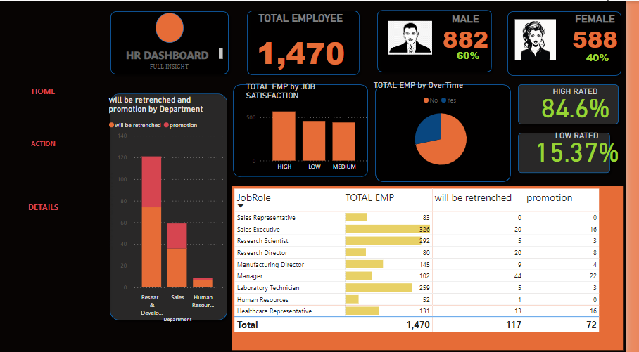

# INCUBATOR-DOCUMENTATION
## DOCUMETATION
## Data outline


## data sources
---
FROM customers_table_week_5
INNER JOIN orders_table_week_5
ON customers_table_week_5 . NAME;
### tools used
- ms excel for cleaning [download here](https//microsoft.com)
- microsoft power bi
- python
- my sql


  ```
  GOOLGLE QUERY SHEET


  SELECT*FROM TABLE 1
  WHERE CONDITION = MET


  ```
